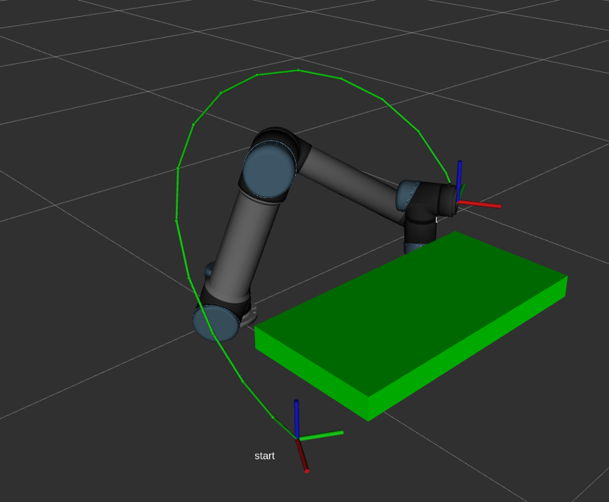

Compling passed on source installation of kinetic-moveit and 1.4.0-ompl.

## About 
A light weight motion planning framework based on Moveit+OMPL. The main contribution in this repository：

- expose planning algorithm api in ompl
- add [CBiRRT](https://www.ri.cmu.edu/pub_files/2009/5/berenson_dmitry_2009_2.pdf) for motion planning with end-effector
- add dual-arm planning api and closure constraints planning

There are three ros packages:

- **yeebot_commute**: provide a service to access the "\joint_states" topic.
- **yeebot_core**: the core files for this framework
- **examples**: contains examples on UR5 and SDA5F robot and experiment materials.
## Install 

Make sure you have installed ROS+Moveit+OMPL. And this is tested on ROS kinetic on Ubuntu 16.04.

```
mkdir -p ~/yeebot_ws/src  # create a new workspace
git clone git@github.com:YeeKal/yeebot.git  #download code
cd ..
catkin_make  
```


## Tutorial

If you want to run the examples, the corresponding moveit configuration package(UR5/SDA5F) should be in your computer.

**UR5**

Firstly launch ur5 moveit configuration demo. You need to download this package before running.

```
roslaunch ur5_moveit_config demo.launch
```
Then launch the service to access joint states.

```
roslaunch yeebot_commute get_joint_states.launch
```
Finally run the main file.

```
rosrun examples max_length_ur5
```

The robot will first move to the start point with no constraint, and then move to the target point with end-effector pose. The restricted is x-rotation and y-rotation which means this constraint simulates the robot holds a cup of water when moving.



**SDA5F**

The tutorial is the same as UR5. The difference is the main file:
```
rosrun examples sda5f_compare
```


This is an experiment running on the real robot.


**SDA5F-Dual arm**

This contains the dual-arm planning and closure constraint planning. In this simulation, a virtual revolute joint is added on the two end-effectors of SDA5F, which means these two end-effector will keep a certain distance and can only rotate about z-axis when moving.

```
rosrun examples dual_arm
```

